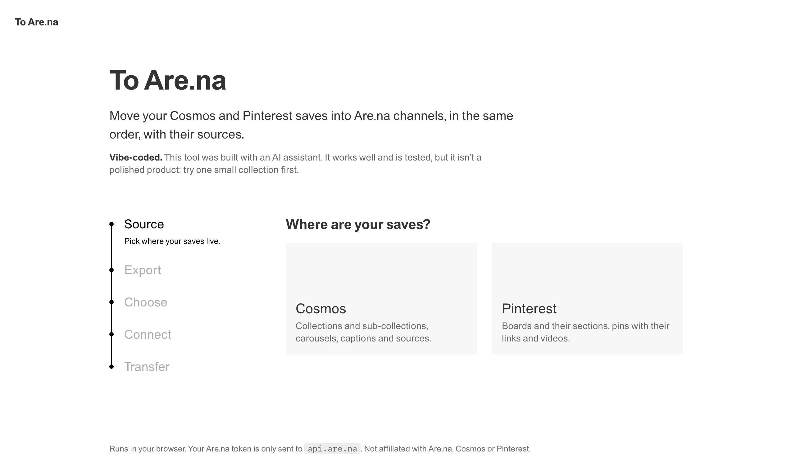

# To Are.na

Move your [Cosmos](https://www.cosmos.so) and [Pinterest](https://www.pinterest.com) saves into
[Are.na](https://www.are.na) channels: each collection or board becomes a channel, with its images, videos, links,
captions and sources, in the same order.



> **Vibe-coded.** This tool was built with an AI assistant. It works well and is tested, but it isn’t a polished
> product: try one small collection first, and check the result on Are.na.

Not affiliated with Are.na, Cosmos or Pinterest.

## Open it

There is nothing to install. Pick one:

### Online, the simplest

Open **[tanguycaruel.github.io/to-arena](https://tanguycaruel.github.io/to-arena/)** in Chrome, Safari, Firefox, Edge
or Arc. Everything runs in your browser: your saves and your Are.na token never go through another server.

### On your computer, Mac or Windows

1. Download **[To-Arena.zip](https://github.com/TanguyCaruel/to-arena/releases/latest/download/To-Arena.zip)**.
2. Unzip it: double-click it on a Mac; on Windows, right-click it, then **Extract All**.
3. Open the **To Are.na** folder and double-click **index.html**. It opens in your web browser.

If the page says it isn’t running, open `index.html` with Chrome, Edge or Firefox instead (right-click › Open With).

## Use it

You need an Are.na account, and your Cosmos or Pinterest account open in the same browser.

1. **Source.** Pick Cosmos or Pinterest.
2. **Export.** Follow the two or three steps on screen. A small script reads your collections on the site, with the
   session already open in your browser, and downloads a `.json` file. Drop that file into the page.
   - Cosmos: drag the **Export from Cosmos** button to your bookmarks bar, then click it on cosmos.so.
   - Pinterest: copy the script, open your Pinterest profile, open the browser console and paste it. Pinterest blocks
     bookmark buttons, except in Firefox.
3. **Choose** the collections or boards to bring.
4. **Connect.** Create an [Are.na personal access token](https://www.are.na/settings/personal-access-tokens) with
   **read and write** access, paste it, then pick the channel privacy and how to handle carousels. The page checks
   that the token can write before going further.
5. **Transfer.** Read the summary, **Simulate first** if you like, then **Transfer**. You can pause and resume.

## What goes where

| Source | Are.na |
| --- | --- |
| Cosmos collection, Pinterest board | Channel (private stays private by default) |
| Cosmos sub-collection, Pinterest section | Channel placed inside its parent’s channel |
| Image, GIF | Image block |
| Video | Attachment block (`.mp4`); Pinterest videos that only stream fall back to their cover image |
| Carousel, Pinterest idea pin | The cover image by default; optionally one block per image, titled “(1/5)”, “(2/5)”… |
| Item saved from Are.na (`are.na/block/…`, image on Are.na’s CDN) | Connection to the original block, as if connected from Are.na |
| Are.na channel saved as a link (`are.na/user/channel`) | Connection of the real channel |
| Link to a website (Cosmos) | Link block, with the Cosmos preview as cover |
| Text (Cosmos) | Text block |
| Cosmos caption | Title (first sentence), description and alt text |
| Pinterest title, description, alt text | Same fields on the block |
| Source link and author | The block’s source, and a “Via …” credit (Cosmos) |
| Item in several collections | One block connected to several channels |
| Whole Cosmos library (optional) | A “Cosmos · all items” channel |

A Pinterest board also lists the pins of its sections: when a section is imported as its own channel inside the
board’s channel, those pins are not repeated in the board’s channel. If the original of an Are.na item is missing or
private, a copy is made instead. The order is kept: items are sent from the oldest to the newest, and Are.na shows
the latest additions first.

## Good to know

- **Free Are.na accounts hold 200 blocks in total.** The page warns you before a transfer that goes over.
- **It takes time.** Are.na limits how many changes it accepts per minute and per hour. The tool spaces its
  requests and, when a limit is reached, waits by itself with a countdown. Keep the tab open; a few thousand items
  can take several hours.
- **No duplicates.** Each block made is noted in your browser and tagged on Are.na with the id of the original item.
  Pause, close the page, switch browsers or retry failed items: what already exists is found and skipped.
- **Images.** Are.na fetches each file from Cosmos or Pinterest. When it refuses a link, the page uploads the file
  itself (or always, with “Upload from this browser” in the advanced options).
- **The exports may break one day.** They rely on the internal, undocumented APIs of Cosmos and Pinterest; if either
  site changes, its export may stop working. The import uses Are.na’s public API.

## Security

- **Your Are.na token** is only sent to `api.are.na`; the page’s Content Security Policy blocks any other
  destination. By default it is forgotten when you close the tab. “Remember it on this computer” keeps it in the
  browser’s storage, which other pages from the same address could read (other local files, or other pages under
  `tanguycaruel.github.io`): avoid it on a shared computer, and revoke the token on Are.na when you are done. The
  token check on **Connect** changes nothing on your account.
- **The export scripts** only read: Cosmos GraphQL queries and Pinterest `GET` requests, made with your open
  session. No password is involved, nothing is written on Cosmos or Pinterest, and the result only goes to the
  downloaded file. Paste into a console only code you trust: these scripts come from the page itself.
- **Export files are treated as untrusted.** Text is shown as text, never as HTML. Only `http(s)` links are kept,
  media must be `https`, and thumbnails and uploads only come from the Cosmos and Pinterest image hosts.
- **The page** loads nothing from outside its own folder: no CDN, no tracker, no external font.

## For developers

No build step and no dependency: plain HTML, CSS and JavaScript.

| File | Role |
| --- | --- |
| `index.html`, `styles.css`, `app.js` | The page |
| `arena.js` | The engine: export files, Are.na API client, transfer plan, resume, rate limits |
| `cosmos-export.js`, `pinterest-export.js` | The export scripts; the page builds the bookmark and console scripts from them |
| `export-kit.js` | Shared pieces of the export scripts: progress panel, download |
| `tests/import.test.mjs` | Engine tests against a fake Are.na API |

```bash
node tests/import.test.mjs
```

To publish a new version of the download, zip the files above (without `tests/`) in a folder named `To Are.na`,
then attach `To-Arena.zip` to a new [release](https://github.com/TanguyCaruel/to-arena/releases).

## Typeface

The design follows an Are.na-style design system set in ABC Areal by Dinamo, a commercial typeface. Its files are
not part of this repository; the page uses Helvetica Neue or Arial instead. If you hold a license, put
`ABCAreal-Regular.woff2`, `ABCAreal-RegularItalic.woff2` and `ABCAreal-Bold.woff2` in a `fonts/` folder.

## License

[MIT](LICENSE)
